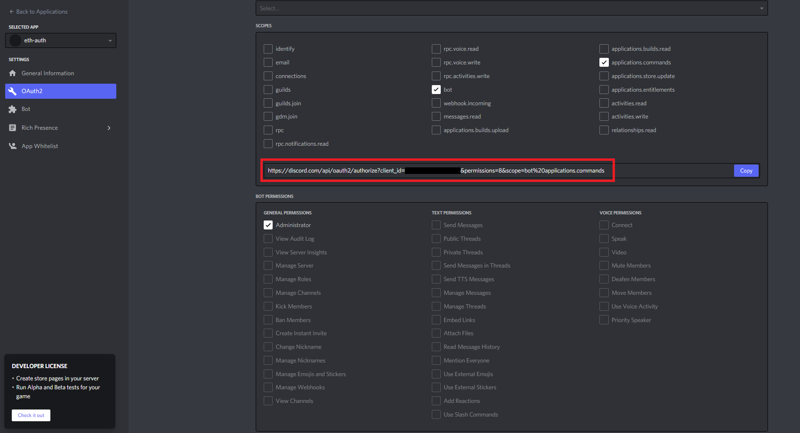

# Verified Ohmies

This is where the code for [Verified Ohmies](https://www.notion.so/olympusdao/Active-Projects-703c573f1fdc42af95035fce2dca2321?p=62e7d754a50140e3a7f5775efff3089d) lives, both frontend and backend. Verified Ohmies is a Discord bot that enables Discord users to prove they own Olympus tokens by signing a message with their wallet, and get a Discord role after successful authentication.

This is similar to what collab.land does for NFT’s, but here we have the added twist that we need to track several different tokens on several different chains.

### Problem: Why is this project needed for the DAO? Which issues are solved by it?

- Reduce the scamming attack surface on our Discord. Users can immediately verify who is a real Ohmie by checking whether they have the verification role.
- Exclusive channels for Olympus token owners could be created.
- Obtaining and keeping the verified role would be another incentive for Ohmies to keep doing (3,3).
- This would also open other avenues, such as enabling the creation of polls on Discord where only verified Ohmies could vote, such that the weight of their vote would be proportional to how many Olympus tokens they own.

### Outcome: How can we measure the success of the project?

- Expected Outcomes

1. Make our Discord safer and scammer-free.
2. Further encourage (3,3) by attributing a verified role.
3. Reinforce the trust between Ohmies.

- Measurable Objectives

1. The number of Ohmies on our Discord using the bot to authenticate themselves on a monthly basis.
2. The amount of scammer reports we’re getting on the server - the harder scammers’ life is, the less they’ll hang out on our Discord and look for lower hanging fruits.

### When: When does it ship and what are the milestones?

- The aim is to have v1 ready around the end of January 2022. This version will include only gOHM on Ethereum Mainnet.
- Taking what we learn from v1, we will incrementally add the rest of the Olympus tokens and the other chains.

## Deployment Setup

Initial setup for deployment is a little complicated, so is being documented here:

1. Create Discord servers
   - One server is required for both production and staging
   - Note the server ID of each
2. Create the Discord role you want to give the user after they've authenticated with Ethereum. For example, `verified`.
   - One role should be created on each of the servers
   - Note the role ID of each (and which server it belongs to)
   - Important: this role must be lower in the hierarchy than the one for the bot you create in the next step, otherwise you'll get a "missing access" error. See [here](https://support.discord.com/hc/en-us/articles/214836687-Role-Management-101) how to move a role up or down in the hierarchy.
3. Create the application for your bot
   - One application should be created on each of the servers
   - [Instructions]<https://discordjs.guide/preparations/setting-up-a-bot-application.html#creating-your-bot>
   - Select the following boxes in the OAuth2 -> URL Generator tab. Open the link marked in red and choose your server to add the bot. 
   - Note the app ID, bot token and public key of each (and which server it belongs to)
4. Set secrets in the GitHub repo. All deployments will use these secrets by default, so avoid using any instances that have production data that could be modified.
   - `VERCEL_ORG_ID`: The Vercel org ID
   - `VERCEL_TEAM_ID`: The Vercel team ID (same as org)
   - `VERCEL_BACKEND_PROJECT_ID`: The Vercel project ID for the backend
   - `VERCEL_FRONTEND_PROJECT_ID`: The Vercel project ID for the frontend
   - `VERCEL_DISCORD_PROJECT_ID`: The Vercel project ID for the Discord bot
   - `VERCEL_TOKEN`:
   - `INFURA_PROJECT_ID`:
   - `JWT_SECRET`: the JWT secret shared between the backend and discord. `node -e "console.log(require('crypto').randomBytes(256).toString('base64'));"`
   - `JWT_EXPIRATION_TIME`: Recommended: 1d
   - `DISCORD_SERVER_ID`: Right-click your server on Discord and select Copy ID to get this
   - `DISCORD_ROLE_ID`: Right-click your server on Discord -> Server Settings -> Roles -> "...". There may be a role already created by the bot integration, but that likely won't work, and you'll need to create a new role.
   - `DISCORD_APP_ID`:
   - `DISCORD_BOT_TOKEN`:
   - `DISCORD_PUBLIC_KEY`:
   - `HASURA_ENDPOINT`:
   - `HASURA_ADMIN_SECRET`:
   - `MORALIS_API_KEY`: Click on your profile picture (top-right), then "API", then copy the value next to "Web3 API Key"
   - `COVALENTHQ_API_KEY`:
   - `ALCHEMY_MAINNET_API_KEY`:
   - `ALCHEMY_RINKEBY_API_KEY`:
5. Set secrets for the production environment
   1. Create the production environment and restrict to the `main` branch: <https://docs.github.com/en/actions/deployment/targeting-different-environments/using-environments-for-deployment#environment-secrets>
   2. On the environments screen, add entries under the "environment secrets" section with production values.
      - `DISCORD_SERVER_ID`
      - `DISCORD_ROLE_ID`
      - `DISCORD_APP_ID`
      - `DISCORD_BOT_TOKEN`
      - `DISCORD_PUBLIC_KEY`
      - `HASURA_ENDPOINT`
      - `HASURA_ADMIN_SECRET`
6. Deploy the stack
   - View the GitHub repo -> Actions tab -> "Run workflow"
7. Set interactions URL
   - After deployment, the interactions URL in Discord can be set (for each app).
   - URL values:
     - Production: `https://verified-ohmies-discord.vercel.app/api/command-interactions`
     - Staging: `https://verified-ohmies-discord-staging.vercel.app/api/command-interactions`
   - Follow these steps:
     1. Visit the applications in the developer portal: <https://discord.com/developers/applications>
     2. Select the app created
     3. Select "General Information" in the sidebar
     4. Enter the domain in the "Interactions Endpoint URL" field, in the format: `https://<domain>/api/command-interactions`
     5. Click "Save Changes".
